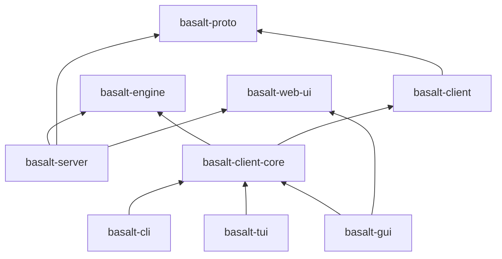

# ADR 0014: Crate Layout

Status: Proposed (2026-07-15)

## Context

[0001](0001-scope.md) already splits the engine core from the network
layer conceptually (embedded library first, client/server wrapping the
same core second). [0006](0006-admin-dev-client.md) commits to one
unified admin/dev client shared across four interface forms (CLI, TUI,
GUI, Web), whose first working form (CLI, [roadmap.md](../roadmap.md)
stage 2) runs in-process against the embedded engine directly, then
gains networked operation once client/server (stage 3) exists — "network
support is added to it, not built as a separate tool." None of that had
been translated into an actual Cargo workspace shape yet, and stage 1
implementation needs at least the first crate to exist
([stage1-plan.md](../stage1-plan.md) flagged this as an open question).

The concrete problem the layout has to solve: the unified client's shared
logic (query editor/REPL engine, schema browsing, result-set model,
explain-plan viz) must run unmodified against two different backends —
talking to `basalt-engine` in-process (stage 2) or talking to a remote
server over the wire protocol (stage 3+) — without becoming two separate
implementations. That requires a boundary/trait somewhere between "client
logic" and "how it actually reaches data," rather than each interface
form (CLI/TUI/GUI) picking its own way to reach the engine.

## Decision

A Cargo workspace with the following crates:

- **`basalt-engine`** — the embedded core: storage engines
  ([0004](0004-relational-storage-engine.md),
  [0010](0010-hierarchical-storage-engine.md)), MVCC/WAL substrate
  ([0008](0008-concurrency-durability.md),
  [0013](0013-page-reclamation.md)), SQL parser
  ([0005](0005-sql-support.md)), and query execution
  ([0009](0009-query-execution.md)). This crate *is* the embedded
  library ([0001](0001-scope.md)'s "independently linkable crate"). No
  networking, no client concerns — it doesn't depend on any other crate
  in this workspace.
- **`basalt-proto`** — wire protocol message types and encode/decode
  ([0007](0007-wire-protocol.md)). Pure data and (de)serialization, no
  I/O. Doesn't exist until stage 3, but the slot is reserved now.
- **`basalt-server`** — binary. Depends on `basalt-engine` and
  `basalt-proto`; listens on the network, reads the TOML server config
  ([0012](0012-server-config.md)), and later also serves the bundled
  HTTP web console ([0006](0006-admin-dev-client.md)). Stage 3+.
- **`basalt-client`** — the native Rust client library
  ([0007](0007-wire-protocol.md)): implements the client side of
  `basalt-proto` over a socket. Doubles as the publishable "talk to
  Basalt from Rust" library and as the networked backend the unified
  client uses. Stage 3+.
- **`basalt-client-core`** — the shared logic behind all four interface
  forms ([0006](0006-admin-dev-client.md)): query editor/REPL engine,
  schema browsing, result-set model, explain-plan visualization. Defines
  a small backend trait (execute query, stream rows, list schema) and
  ships two adapters against it — one wrapping `basalt-engine` directly
  (in-process), one wrapping `basalt-client` (networked). Everything
  above this crate is backend-agnostic.
- **`basalt-cli`**, **`basalt-tui`**, **`basalt-gui`** — thin binaries,
  each wiring `basalt-client-core` (plus whichever backend is selected at
  runtime) to its own UI toolkit: reedline, ratatui+crossterm, Tauri
  respectively ([0006](0006-admin-dev-client.md)).
- **`basalt-web-ui`** — the shared web frontend: the actual assets/code
  rendered both inside the Tauri GUI's webview and by `basalt-server`'s
  bundled web console over HTTP ([0006](0006-admin-dev-client.md)). A
  separate crate rather than living inside `basalt-gui` or
  `basalt-server`, since both of those consume it rather than either one
  owning it. Frontend framework/stack not yet chosen (still open, see
  [backlog.md](../backlog.md)).

Staging: stage 1 needs only `basalt-engine`. Stage 2 adds
`basalt-client-core` (in-process adapter only) and `basalt-cli`. Stage 3
adds `basalt-proto`, `basalt-server`, `basalt-client`, and the networked
adapter in `basalt-client-core`/`basalt-cli`. No crate is rewritten to
get there, only extended.

## Consequences

- `basalt-engine` never depends on anything client- or network-related,
  matching [0001](0001-scope.md)'s explicit split between engine core
  and network layer; it stays usable as a pure embedded library with no
  pull-in of client code.
- `basalt-client-core` depending on both `basalt-engine` and
  `basalt-client` is deliberate: it's the integration point that makes
  [0006](0006-admin-dev-client.md)'s "in-process first, networked later,
  same tool" staging literal. The trait boundary lives inside
  `basalt-client-core`, not smeared across the CLI/TUI/GUI binaries —
  each of those stays a thin wiring layer.
- Reserving `basalt-proto`/`basalt-server`/`basalt-client` as empty slots
  from stage 1 onward costs nothing now but means the eventual stage-3
  work slots into an already-agreed shape rather than requiring a
  workspace reorganization.
- Extracting `basalt-web-ui` as its own crate avoids duplicating frontend
  code between `basalt-gui` and `basalt-server`, matching
  [0006](0006-admin-dev-client.md)'s expectation that the web console
  reuses the GUI's frontend rather than being written separately; it also
  means the still-open frontend framework choice (see
  [backlog.md](../backlog.md)) is made once, in one place.
- Crate names (`basalt-*` prefix, `client-core` naming) are a bikeshed,
  not load-bearing, and can be renamed later without affecting this
  decision's substance.
- This ADR does not decide internal module structure within
  `basalt-engine` (e.g. how storage/MVCC/SQL/execution are split into
  modules) — that's an implementation detail for
  [stage1-plan.md](../stage1-plan.md)'s chunks, not a workspace-level
  concern.

## Update (2026-07-16)

`basalt-engine` renamed to `engine`: `basalt`, `basalt-cli`, and
`basalt-tui` turned out to already be taken on crates.io by an unrelated
project (see [backlog.md](../backlog.md)), which reopened the
`basalt-*` prefix as a live question rather than a settled bikeshed.
Dropping the prefix from the one crate that exists so far avoids
carrying a name that may not survive publishing; the other reserved
slots (`basalt-proto`, `basalt-server`, `basalt-client`,
`basalt-client-core`, `basalt-cli`, `basalt-tui`, `basalt-gui`,
`basalt-web-ui`) keep their names for now pending that backlog item.
